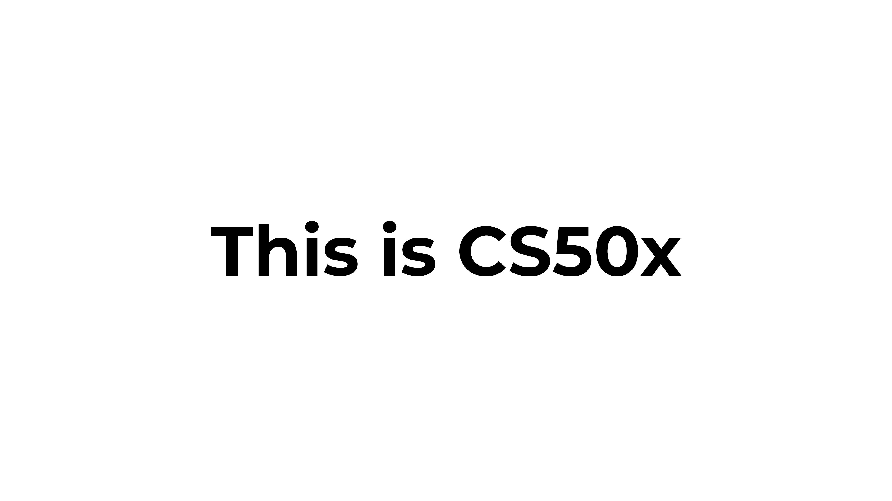

# Studying Computer Science and Programming

### About the repository

This repository is supposed to show my studies in both Computer Science and Programming and also demonstrate some projects in the area that I'm interested in.

All the courses in this repository are present in the [*EdX site*](https://www.edx.org/), we can find courses about several topics and fields of science, designed to enhance your skills as a experienced professional or introduce new voluteers to start growing their knowledge and opportunities. And since I want to get better in what I do, I craved and attached to the opportunity, and here I am.

***PS:** This is the first english repository I'm creating, and since english is not my first language, it might exist some mistakes within the grammar or my writing and I'll probably repeat myself most of the time, but I won't stop because of that, since practice is what make things perfect, right?*

`Anyway, I'll be doing my best!`

# This is CS50x - Introduction to Computer Science

### Hello, world!

Course of Computer Science presented by [*Harvard University*](https://www.edx.org/school/harvardx) taught by [*David J. Malan.*](https://cs.harvard.edu/malan/) 

This being the Harvard University's introduction to the intellectual enterprises of **computer science** and the art of programming for majors and non-majors alike, with or without prior programming experience. And as I'm a enthusiast in this subject, I couldn't let that pass, since It's a great opportunity to improve my skill levels and deep understanding of the computers, so I'll be working in some projects from now.

## Contents

This is a online course distributed by Harvard University to help beginners and enthusiasts to learn how computers works, introducing them to different concepts and programming languages.

## In this course, the following topics will be discussed:

- Scracth

- C

- Arrays

- Algorithms

- Memory

- Data Structures

- Python

- SQL

- HTML, CSS and javaScript

- Flask

- Emoji

- Cybersecurity

## Challenges

- Scratch Challenge(s) (coming soon)